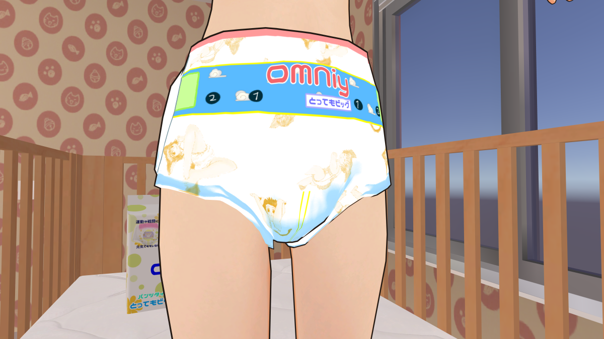
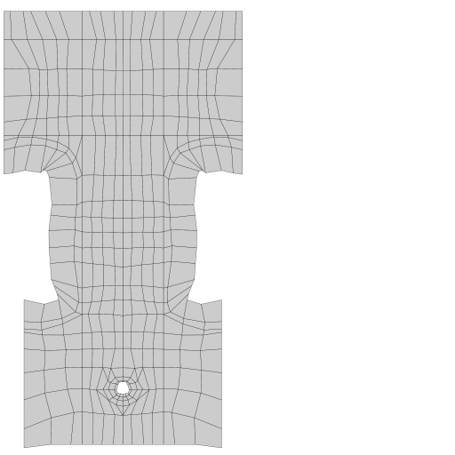

# Open Diaper

3Dヒューマノイドモデル向けおむつ3Dモデル及びテクスチャ

Open Diaperは、自由にアバターへの組み込みや改変ができるおむつの3Dモデルです。

mesh、texture、normalディレクトリ以下の3Dモデルデータ及びテクスチャを組み合わせて、ご利用のアバターに合わせたおむつをセットアップできます。

## アバター作成者の方へ

3Dアバター作成・公開の際にmeshディレクトリ以下の3Dモデルとuv_guideディレクトリ以下のUVガイド画像に合わせてUVを設定して頂ければ、当リポジトリのテクスチャをそのまま利用できるようになります。

## contributor

- 中村あぞ
    - texture\diaper_tape_tail_texture_002.png
    - texture\diaper_tape_tail_texture_003.png

## Open Diaper License

Copyright (c) 2021 Syuji / ねこみみシッター

以下に定める条件に従い、本ソフトウェアおよび関連文書のファイル（以下「ソフトウェア」）の複製を取得するすべての人に対し、ソフトウェアを無制限に扱うことを無償で許可します。これには、ソフトウェアの複製を使用、複写、変更、結合、掲載、頒布、サブライセンス、および/または販売する権利、およびソフトウェアを提供する相手に同じことを許可する権利も無制限に含まれます。

ソーシャルコミュニケーションプラットフォームやオンラインゲームプラットフォーム上で利用するために本ソフトウェアの複製をアップロードする際に記載が困難な場合を除き、上記の著作権表示および本許諾表示を、ソフトウェアのすべての複製または重要な部分に記載するものとします。

ソフトウェアは「現状のまま」で、明示であるか暗黙であるかを問わず、何らの保証もなく提供されます。ここでいう保証とは、商品性、特定の目的への適合性、および権利非侵害についての保証も含みますが、それに限定されるものではありません。
作者または著作権者は、契約行為、不法行為、またはそれ以外であろうと、ソフトウェアに起因または関連し、あるいはソフトウェアの使用またはその他の扱いによって生じる一切の請求、損害、その他の義務について何らの責任も負わないものとします。

