# Unity上でリギング済みOpen DiaperをHumanoidに装着する

## 概要

本手順書では、Boothにて配布中の着せ替え支援ボーン移植エディタを利用して、Unity上でリギング済みOpen DiaperをHumanoid 3Dモデルに装着する手順を説明します。

## 準備

下記のソフトウェアをダウンロードおよびインストールしておきます。

- Unity 2018.4.20f1（2021年5月現在のVRChat SDK対応バージョン）
- Open DiaperのUnitypackage（今回の表示名：rig_opendiaper_v2_02　プロジェクト内の**SetupForUnity/OpenDiaperV2ForUnity.unitypackage**に存在）
- Open Diaperを装着する対象のHumanoid 3Dモデル（今回の表示名：VRoid_sotai　各自で用意）
- [着せ替え支援ボーン移植エディタ](https://booth.pm/ja/items/954433)
- opendiaper_kisekae.xml（着せ替え支援ボーン移植エディタの設定ファイル。プロジェクト内の**SetupForUnity/opendiaper_kisekae.xml**に存在）

## 作業手順

1. Unityの**Asetts/Import Package/Custom Package**…からダウンロードしたOpenDiaperV2ForUnity.unitypackageと着せ替え支援ボーン移植エディタのunitypackage。あるならHumanoid 3Dモデルのunitypackageをそれぞれインポートする。

2. ヒエラルキー（Hierarchy）にHumanoid 3DモデルとOpen Diaper 3Dモデルをドラッグアンドドロップする
   調整しやすくするため、両方のPositionはすべて0にしておく。
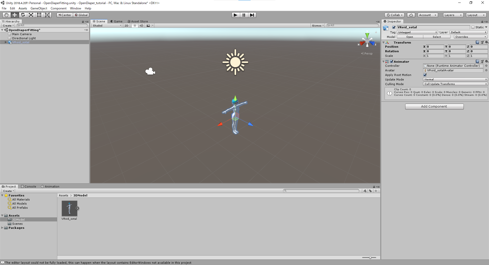
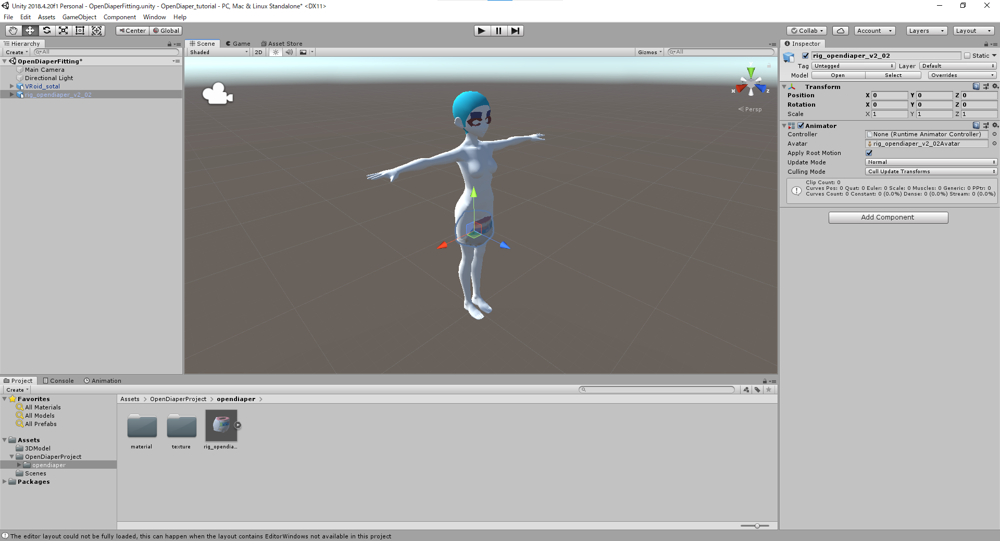

1. ヒエラルキーに表示されたHumanoid 3DモデルとOpen Diaper 3Dモデルを右クリックして、「Unpack prefab」を実行する
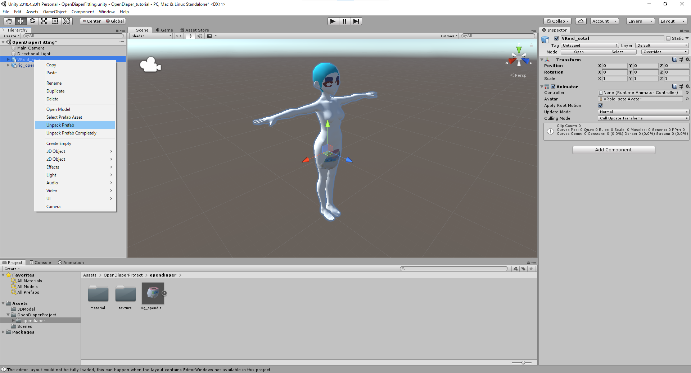
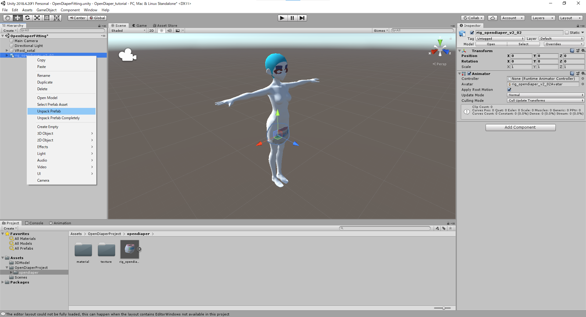

1. メニューバーの「Cloth Editor」→「Bone setup」から着せ替え支援ボーン移植エディタを開く
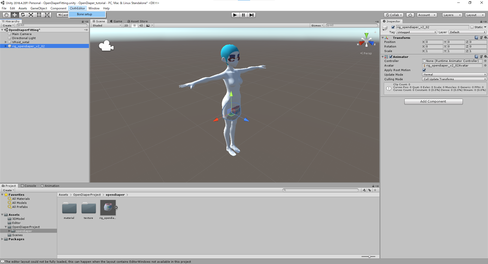
着せ替え支援ボーン移植エディタを開いたところ
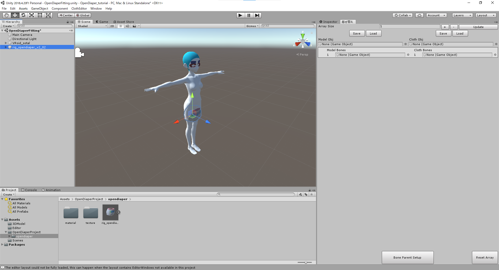

1. Model objの欄に、Humanoid 3Dモデルオブジェクトを設定する
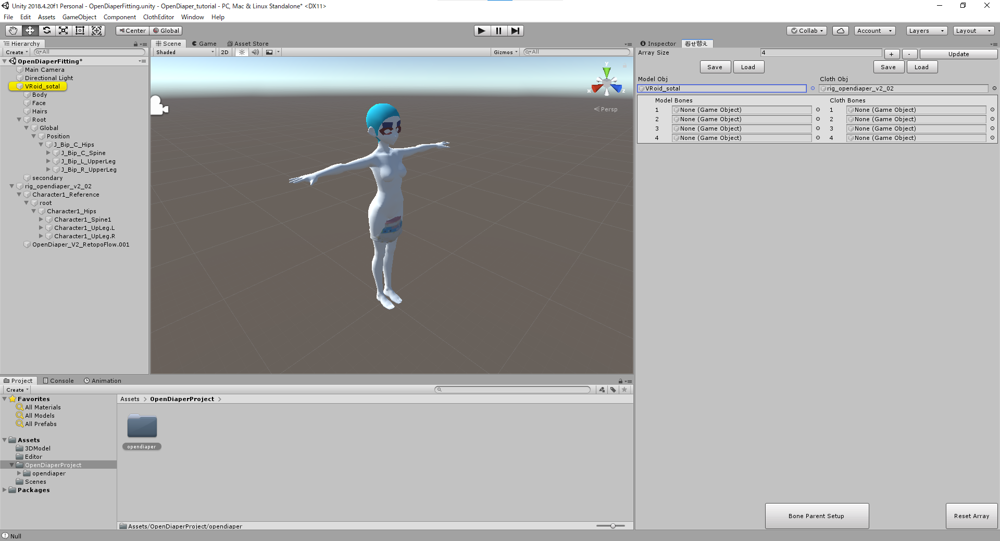

1. Cloth objの欄に、Open Diaperオブジェクトを設定する

1. 右側のLoadボタンをクリックし、opendiaper_kisekae.xmlを読み込む

opendiaper_kisekae.xml読み込み完了後
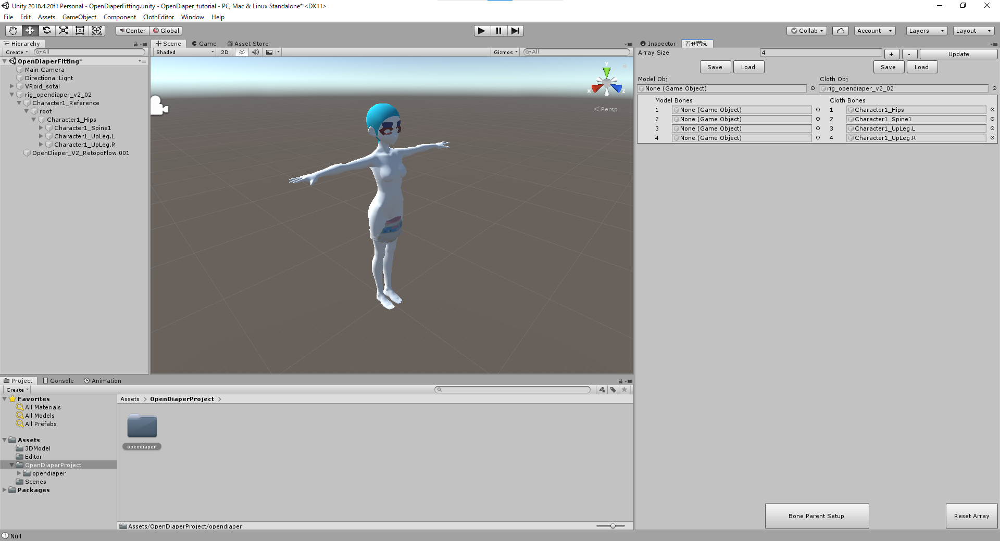

1. Humanoid 3Dモデルの対象ボーンを着せ替え支援ボーン移植エディタに設定する
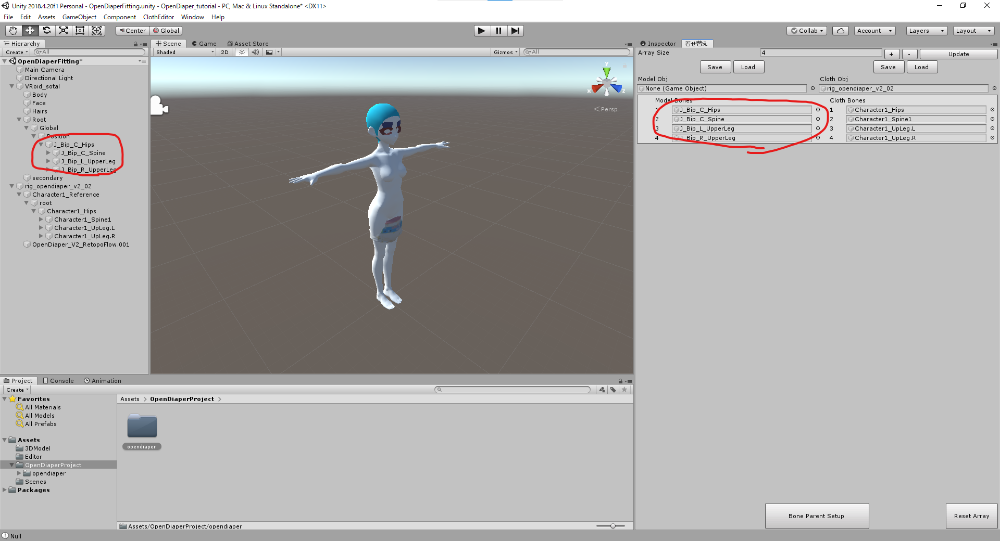
対象となるボーンは、上からHips、Spine、UpperLeg_L、UpperLeg_Rです。

1. Open Diaperオブジェクトの位置とサイズを左上のTranceform機能で移動・変形して、Humanoid 3Dモデルの腰回りに合わせる
  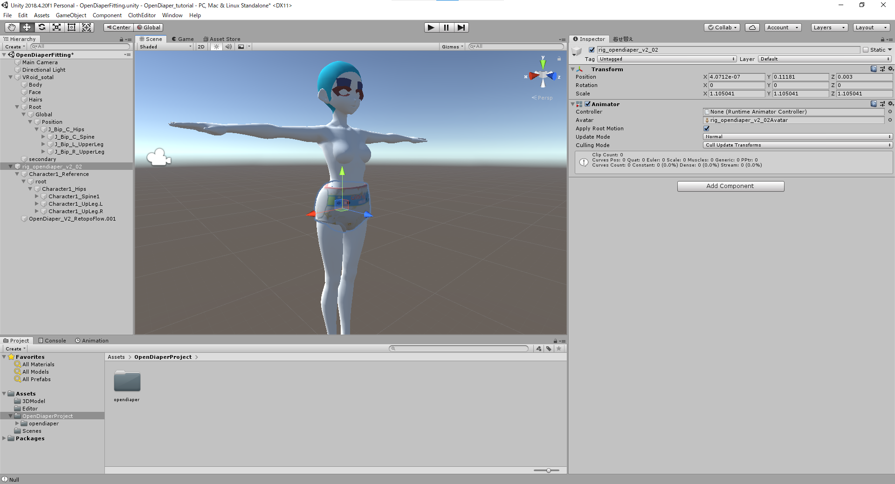

1. 「Bone Parent Setup」ボタンを押して着せ替えを実行する

ダイアログボックスを読み、OKボタンをクリックする
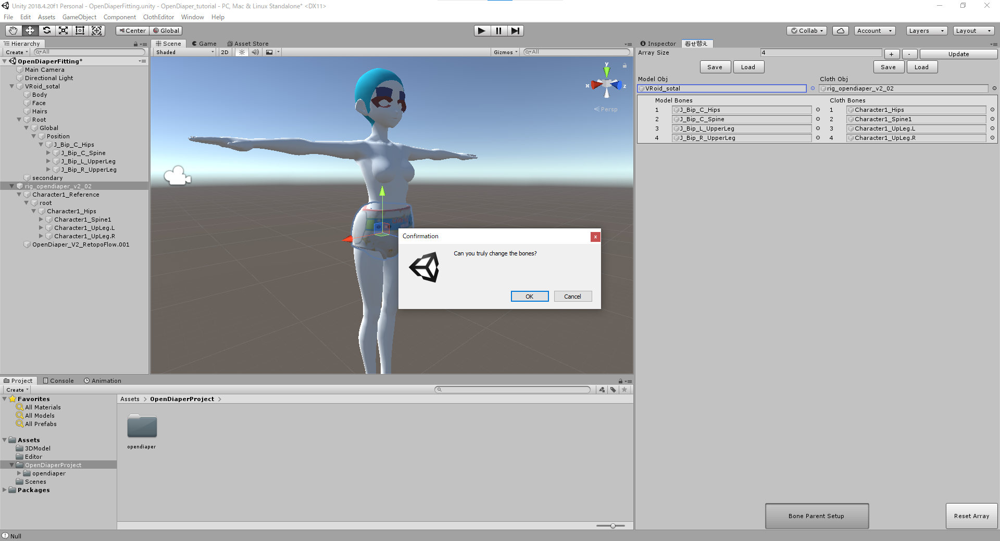

1. Humanoid 3Dモデルと親子関係になるように、Open Diaper 3DモデルをHumanoid 3Dモデルの直下にドラッグアンドドロップする
画像の場合、VRoid_sotaiにドラッグアンドドロップすると、直下にファイルが移動する。
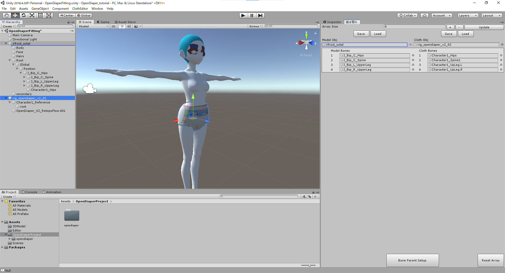

1. Rotate（回転マーク）でHumanoid 3Dモデルの脚（UpperLeg_L、UpperLeg_R）を動かし、Open Diaperがボーンに追従するか確かめる
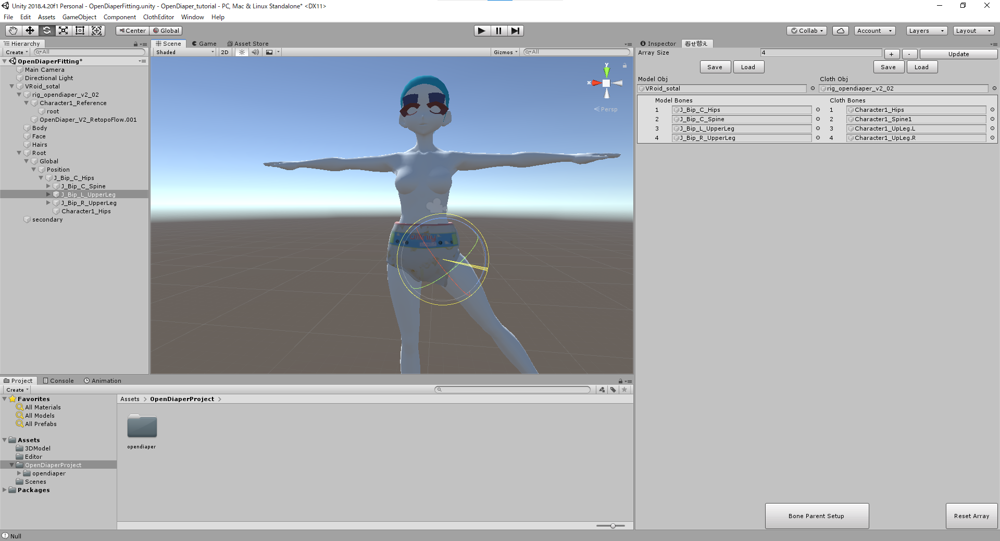
確認したら、脚を元に戻しておく必要があるため、確認後CTRL+Zで数値を戻す。
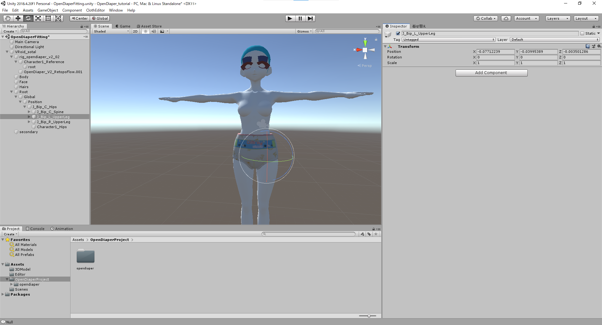

以上の手順で完了となります。

この後、VRChatにアップロードする場合には、通常のVRChat SDKを用いたアバターの設定が必要となります。

